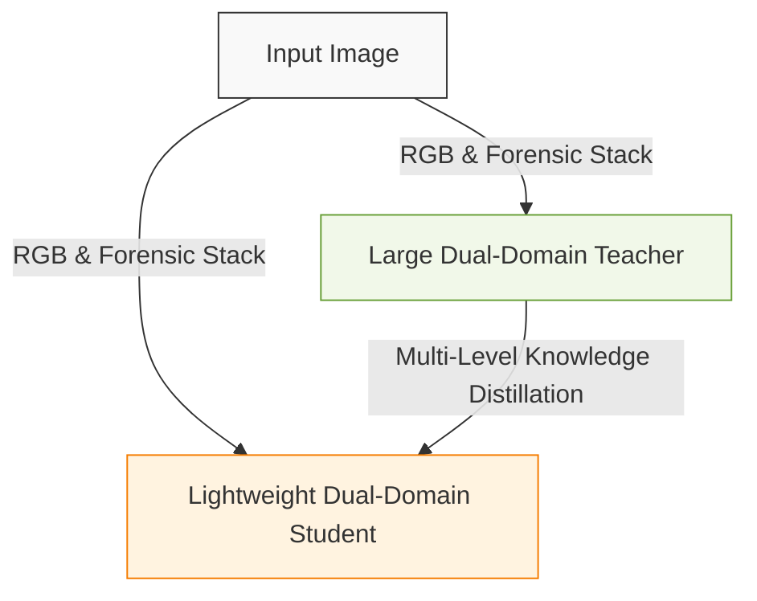
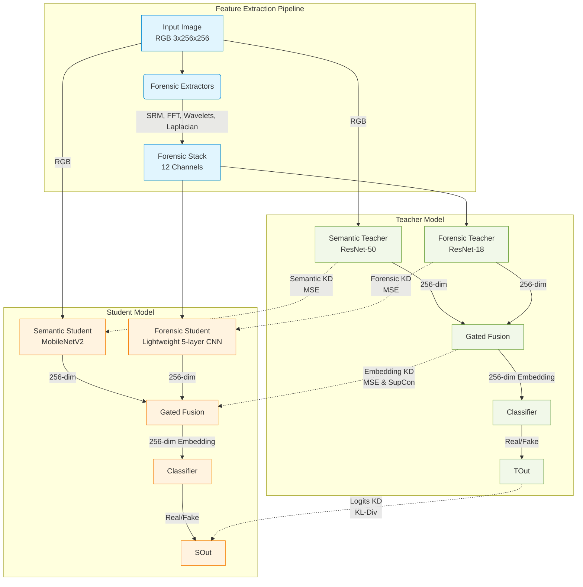
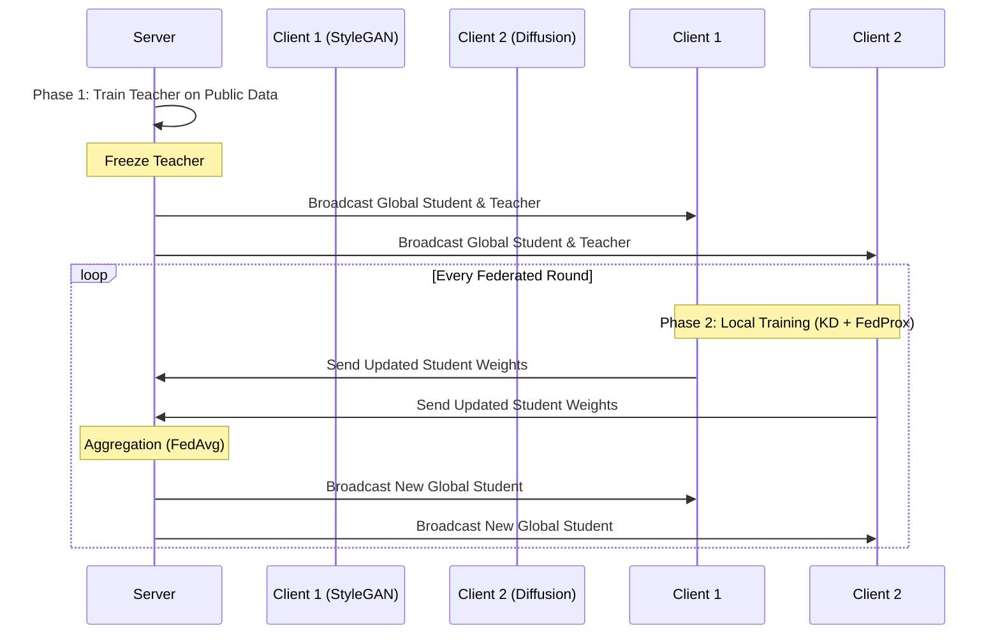
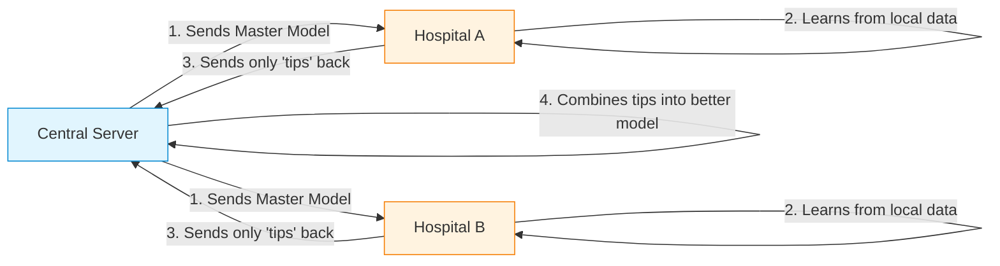

# Technical Architecture: Federated Deepfake Detection (Dual-Domain)

This document provides an in-depth technical explanation of the Federated Deepfake Detection project, covering the architectural design, feature extraction methods, loss functions, and the transition from a centralized to a federated learning paradigm.

## 1. System Architecture and Design Choices

The system relies on a Dual-Domain Teacher-Student Knowledge Distillation (KD) framework.

### 1.1 Simplified Architecture Pipeline

### 1.2 Detailed Architecture Diagram

### 1.3 Architectural Component Choices
1. **Teacher Model (~35.5M Params):** 
   - **Semantic Branch (ResNet-50):** Provides powerful semantic understanding of RGB images.
   - **Forensic Branch (ResNet-18):** Modified to accept 12 channels. Analyzes high-frequency manipulation artifacts.
2. **Student Model (~4.3M Params):**
   - **Semantic Branch (MobileNetV2):** Uses ImageNet pretraining to quickly learn structural anomalies from RGB.
   - **Forensic Branch (Lightweight CNN):** Since ImageNet weights don't transfer to 12-channel forensic signals, a lightweight custom CNN (~500K params) is used for extreme efficiency.
3. **Gated Fusion:** Instead of blind concatenation, a learned sigmoid gate dynamically weighs the importance of semantic vs. forensic features for each individual image.
4. **Multi-Level Knowledge Distillation:** The student receives guidance not just at the final output, but at every intermediate representation (Semantic, Forensic, and Fused Embedding). This forces the lightweight student to mimic the exact feature reasoning of the massive teacher.

---

## 2. Feature Extraction Methods

The pipeline extracts specific signals to expose deepfakes through the **Forensic Stack (12 Channels)**:

*   **SRM (Steganalysis Rich Model) [3 channels]:** Uses high-pass filters to extract noise residuals. Real cameras have physical noise characteristics; deepfake generators leave distinctly different statistical noise patterns.
*   **FFT (Fast Fourier Transform) [3 channels]:** Deepfake upsampling techniques often leave spectral artifacts (unusual frequency distributions) that are invisible in the spatial domain but glow brightly in the frequency domain.
*   **Wavelet (Haar) [3 channels]:** Decomposes the image to capture multi-scale texture inconsistencies, highlighting areas where high-frequency details don't match the low-frequency structure.
*   **Laplacian [3 channels]:** A second-derivative edge detector. It is highly sensitive to blending boundary artifacts left by Face-swap and inpainting operations.

---

## 3. Loss Functions and Mathematical Foundations

To ensure formatting compatibility, equations are presented using standard inline mathematical notation ($...$).

### 3.1 Focal Loss (Primary Classification)
> **Focal Loss** = (1 - probability_true)^2 * CrossEntropyLoss

> [!TIP]
> **Benefit:** Standard Cross Entropy is replaced with Focal Loss (Gamma = 2.0) and label smoothing (0.1). This heavily down-weights the loss for easy, obvious fakes and forces the model to focus its learning capacity on the hardest, most subtle deepfakes, significantly improving recall.

### 3.2 Multi-Level Knowledge Distillation (KD) Loss
The KD process operates at multiple levels of the network:
> **Logits KD Loss** = Temperature^2 * KL_Divergence( Softmax(Student_Logits / Temp) , Softmax(Teacher_Logits / Temp) )
> **Feature KD Loss** = MSE(Student_Features, Teacher_Features)

> [!TIP]
> **Benefit:** Soft labels convey structural uncertainty (e.g. 95% fake, 5% real). Intermediate feature KD (Semantic and Forensic) ensures the student learns the exact reasoning pathways of the teacher.

### 3.3 Supervised Contrastive (SupCon) Loss
> **SupCon Loss** = -1/Positives * Sum [ Log( Exp(Similarity(i, positive)/Temp) / Sum(Exp(Similarity(i, all)/Temp)) ) ]

> [!TIP]
> **Benefit:** Implemented using the log-sum-exp trick for fp16 stability. This shapes the latent space by forcibly pulling the 256-dim embeddings of real images together while pushing fake image embeddings away, ensuring robust linear separability.

### 3.4 FedProx Regularization (Federated Only)
> **FedProx Loss** = Local_Loss + (Mu / 2) * L2_Distance(Local_Weights, Global_Weights)^2

> [!WARNING]
> **Benefit:** In non-IID federated settings, Client A (seeing only StyleGAN) will overfit and drift away from Client B. FedProx adds a proximal penalty (Mu / 2) * L2_Distance(Local_Weights, Global_Weights)^2 that acts like an elastic band, forcing each client's local updates to stay anchored near the global model's consensus. In our architecture, Mu is kept low (0.001) to prevent optimization collapse.

*(Note: Gradient Reversal Layer / Adversarial Training is currently disabled in the architecture as the forensic branch natively benefits from generator-specific traces).*

---

## 4. Centralized vs. Federated Paradigms

### 4.1 Centralized Flow
In the centralized version (`main.py`), all data is located on a single server. Training happens sequentially:
1. **Stage 1:** Train Teacher on full dataset (RGB + Forensic). Freeze Teacher.
2. **Stage 2:** Train Student using Multi-Level KD from the frozen Teacher.

### 4.2 Federated Flow and Architecture Shifts
In the federated version (`main_federated.py`), data is distributed across multiple clients.

#### How the Component Roles Shift:
*   **Teacher Model:** Trained *once* centrally, frozen, and distributed identically to all clients. It is NOT updated during federated rounds.
*   **Student Model:** This is the core federated component. Its weights are sent back and forth between the server and clients, aggregated via **FedAvg**: 
    > **Global_Weights** = Sum over clients ( (Client_Data_Size / Total_Data_Size) * Client_Weights )

### 4.3 ELI5: Federated Learning Simplified

#### The Cookie Analogy
Imagine you and your friends want to bake the **Ultimate Cookie**, but you aren't allowed to show each other your secret ingredients (your private data).

1.  **The Master Recipe:** A "Head Baker" (the Server) sends a basic cookie recipe to everyone.
2.  **Home Baking:** You and your friends (the Clients) bake the cookies in your own kitchens. You use your own secret ingredients to make the recipe better.
3.  **Sending Tips:** Instead of sharing your secret ingredients, you just tell the Head Baker *how* you changed the recipe (e.g., "I added more sugar" or "I baked it 2 minutes longer").
4.  **The Big Mix:** The Head Baker takes everyone's tips, mixes them together, and creates a new "Master Recipe" that is better than any individual one.
5.  **Repeat:** The Head Baker sends this new Master Recipe back to everyone, and you repeat the process until the cookies are perfect!

**Result:** Everyone gets the best cookie recipe in the world without anyone ever seeing anyone else's private kitchen secrets.

#### Simplified Federated Diagram

