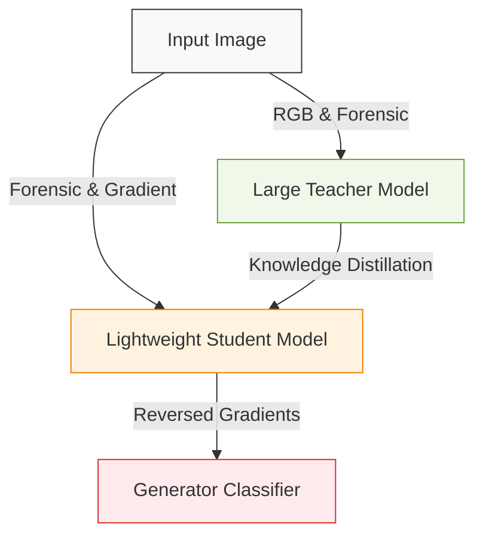
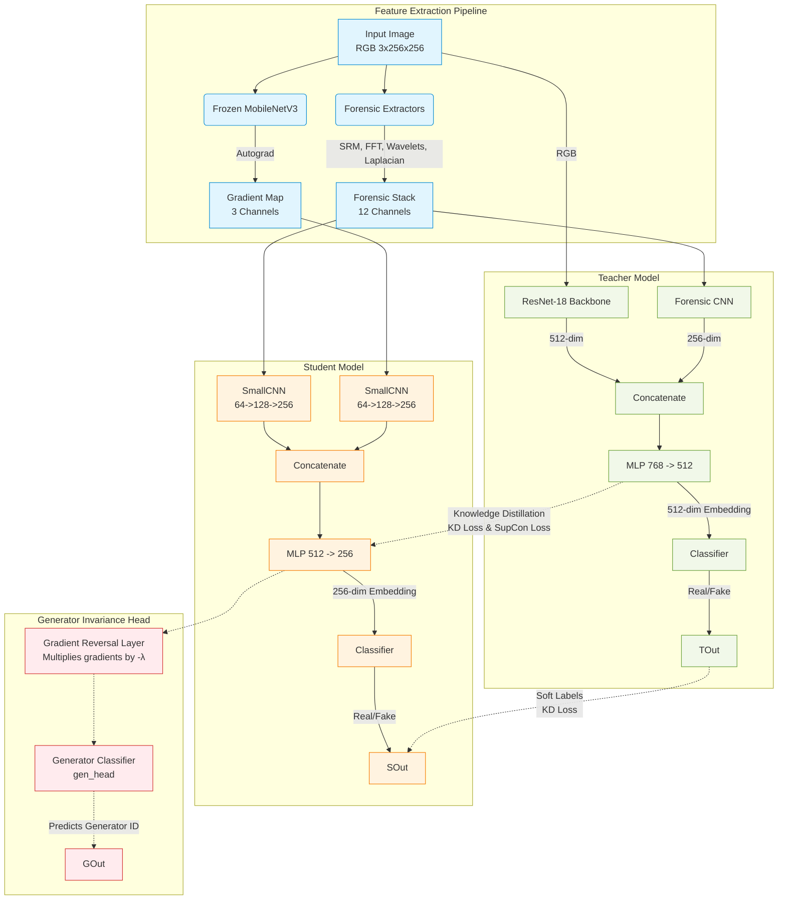
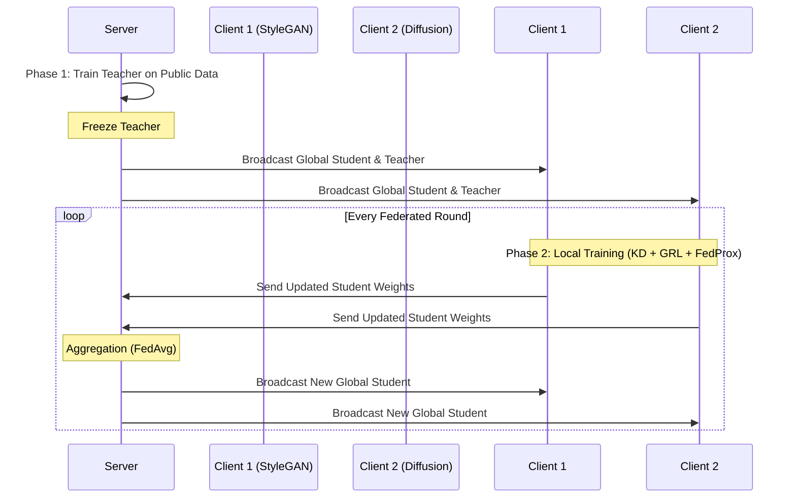
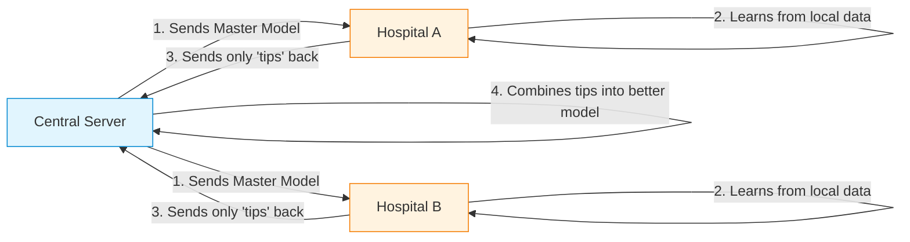

# Technical Architecture: Federated Deepfake Detection

This document provides an in-depth technical explanation of the Federated Deepfake Detection project, covering the architectural design, feature extraction methods, loss functions, and the transition from a centralized to a federated learning paradigm.

## 1. System Architecture and Design Choices

The system relies on a Teacher-Student Knowledge Distillation (KD) framework enhanced with Adversarial Training via a Gradient Reversal Layer (GRL).

### 1.1 Simplified Architecture Pipeline

### 1.2 Detailed Architecture Diagram

### 1.3 Architectural Component Choices
1. **Teacher Model (ResNet-18):** Chosen because it provides a powerful semantic understanding of RGB images (~11.7M parameters) without being overly massive. It is strong enough to accurately detect deepfakes and generate high-quality "soft labels" to guide the Student, but small enough to train efficiently.
2. **Student Model (Small CNN):** Chosen for extreme deployability. With only ~1.0M parameters, it is incredibly lightweight. This makes it ideal for deployment on edge devices and drastically reduces the communication payload required during Federated Learning transmission rounds.
3. **Gradient Extractor (MobileNetV3):** We extract an ImageNet-level activation gradient. MobileNetV3 is chosen over a ResNet because it is incredibly fast and lightweight (~2.5M params vs 11.7M). Since the extractor must run a full forward and backward pass for every single image, MobileNetV3 reduces the computational bottleneck by 3-4x.
4. **Student is Blind to RGB:** The Student never sees raw RGB pixels. By forcing it to rely entirely on Forensic signals and Gradient maps, it learns manipulation artifacts independent of image content, preventing it from memorizing specific generator flaws (e.g., "StyleGAN eyes").
5. **Knowledge Distillation (KD):** To make the lightweight Student accurate despite lacking RGB vision, the massive Teacher model guides it using "dark knowledge" (soft probabilities).

---

## 2. Feature Extraction Methods

The pipeline extracts five specific signals (15 total channels) to expose deepfakes without relying on RGB content.

*   **SRM (Steganalysis Rich Model) [3 channels]:** Uses high-pass filters to extract noise residuals. Real cameras have physical noise characteristics; deepfake generators leave distinctly different statistical noise patterns.
*   **FFT (Fast Fourier Transform) [3 channels]:** Deepfake upsampling techniques often leave spectral artifacts (unusual frequency distributions) that are invisible in the spatial domain but glow brightly in the frequency domain.
*   **Wavelet (Haar) [3 channels]:** Decomposes the image to capture multi-scale texture inconsistencies, highlighting areas where high-frequency details don't match the low-frequency structure.
*   **Laplacian [3 channels]:** A second-derivative edge detector. It is highly sensitive to blending boundary artifacts left by Face-swap and inpainting operations.
*   **Gradient Map [3 channels]:** Derived by backpropagating a classification loss through a frozen MobileNetV3. Fake images cause unnatural, concentrated activation gradients compared to real images.

---

## 3. Loss Functions and Mathematical Foundations

To ensure formatting compatibility, equations are presented using standard inline mathematical notation ($...$).

### 3.1 Focal Loss (Primary Classification)
> **Focal Loss** = (1 - probability_true)^2 * CrossEntropyLoss

> [!TIP]
> **Benefit:** Standard Cross Entropy is replaced with Focal Loss (Gamma = 2.0) and label smoothing (0.1). This heavily down-weights the loss for easy, obvious fakes and forces the model to focus its learning capacity on the hardest, most subtle deepfakes, significantly improving recall.

### 3.2 Knowledge Distillation (KD) Loss
> **KD Loss** = Temperature^2 * KL_Divergence( Softmax(Student_Logits / Temperature) , Softmax(Teacher_Logits / Temperature) )

> [!TIP]
> **Benefit:** Soft labels convey structural uncertainty. If the Teacher predicts an image is 95% fake and 5% real, that 5% contains information. High temperature T=4.0 softens the distribution to reveal this, giving the Student richer learning signals than hard binary labels.

### 3.3 Supervised Contrastive (SupCon) Loss
> **SupCon Loss** = -1/Positives * Sum [ Log( Exp(Similarity(i, positive)/Temp) / Sum(Exp(Similarity(i, all)/Temp)) ) ]

> [!TIP]
> **Benefit:** Implemented using the log-sum-exp trick for fp16 stability. This shapes the latent space by forcibly pulling the 256-dim embeddings of real images together while pushing fake image embeddings away, ensuring robust linear separability.

### 3.4 Adversarial Generator Invariance via GRL
> **Adversarial Loss** = CrossEntropy( Generator_Classifier( Gradient_Reversal(Student_Features) ) , True_Generator_ID )

> [!IMPORTANT]
> **Benefit:** The Gradient Reversal Layer (GRL) multiplies gradients by a negative weight (-Lambda) during backpropagation. The Generator Classifier attempts to predict *which* specific deepfake generator created the image. The GRL reverses this signal, explicitly rewarding the Student for **confusing the Generator Classifier**. This strips away generator-specific shortcuts and forces the learning of *universal* forgery artifacts.

### 3.5 FedProx Regularization (Federated Only)
> **FedProx Loss** = Local_Loss + (Mu / 2) * L2_Distance(Local_Weights, Global_Weights)^2

> [!WARNING]
> **Benefit:** In non-IID federated settings, Client A (seeing only StyleGAN) will overfit and drift away from Client B. FedProx adds a proximal penalty (Mu / 2) * L2_Distance(Local_Weights, Global_Weights)^2 that acts like an elastic band, forcing each client's local updates to stay anchored near the global model's consensus.

---

## 4. Centralized vs. Federated Paradigms

### 4.1 Centralized Flow
In the centralized version (`main.py`), all data is located on a single server. Training happens sequentially:
1. **Stage 1:** Train Teacher on full dataset (RGB + Forensic). Freeze Teacher.
2. **Stage 2:** Train Student using KD from the frozen Teacher.
3. **Stage 3:** Attach GRL and `gen_head` to train the Student for generator invariance.

### 4.2 Federated Flow and Architecture Shifts
In the federated version (`main_federated.py`), data is distributed across multiple clients.

#### How the Component Roles Shift:
*   **Teacher Model:** Trained *once* centrally, frozen, and distributed identically to all clients. It is NOT updated during federated rounds.
*   **Student Model:** This is the core federated component. Its weights are sent back and forth between the server and clients, aggregated via **FedAvg**: 
    > **Global_Weights** = Sum over clients ( (Client_Data_Size / Total_Data_Size) * Client_Weights )
*   **Generator Head (`gen_head`):** **NOT federated.** Because clients have completely different generators (non-IID), their `gen_head` classifiers have different classes. Each client keeps its `gen_head` strictly local.

### 4.3 Synergy: GRL + Federated Learning
Without GRL, federated clients would independently learn conflicting, generator-specific features, making `FedAvg` produce a confused global model. 
With GRL applied *locally*, each client is forced to learn universal features *before* aggregation. Because all clients extract universal features, their weights align naturally during `FedAvg`, resulting in a highly robust global detector.

### 4.4 ELI5: Federated Learning Simplified

#### The Cookie Analogy
Imagine you and your friends want to bake the **Ultimate Cookie**, but you aren't allowed to show each other your secret ingredients (your private data).

1.  **The Master Recipe:** A "Head Baker" (the Server) sends a basic cookie recipe to everyone.
2.  **Home Baking:** You and your friends (the Clients) bake the cookies in your own kitchens. You use your own secret ingredients to make the recipe better.
3.  **Sending Tips:** Instead of sharing your secret ingredients, you just tell the Head Baker *how* you changed the recipe (e.g., "I added more sugar" or "I baked it 2 minutes longer").
4.  **The Big Mix:** The Head Baker takes everyone's tips, mixes them together, and creates a new "Master Recipe" that is better than any individual one.
5.  **Repeat:** The Head Baker sends this new Master Recipe back to everyone, and you repeat the process until the cookies are perfect!

**Result:** Everyone gets the best cookie recipe in the world without anyone ever seeing anyone else's private kitchen secrets.

#### Simplified Federated Diagram

