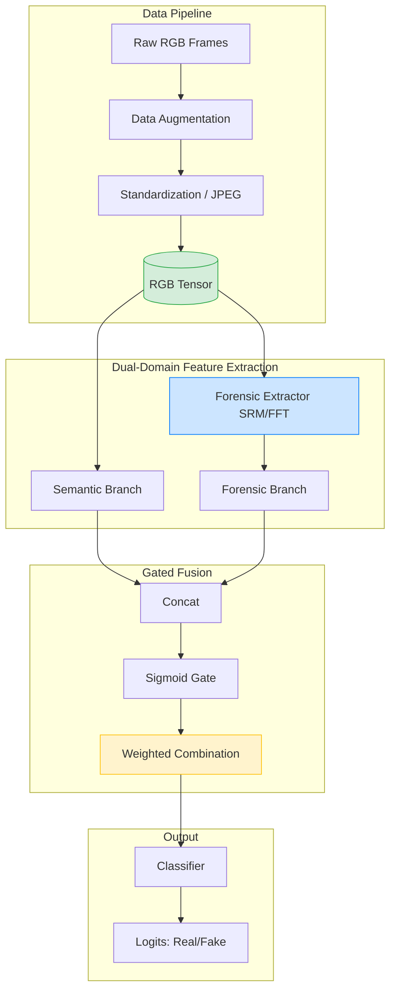
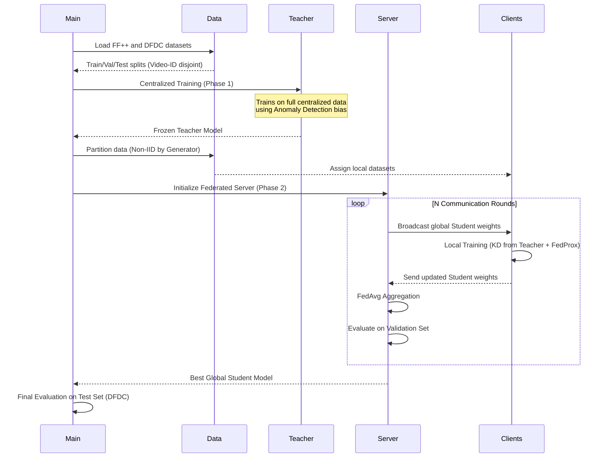
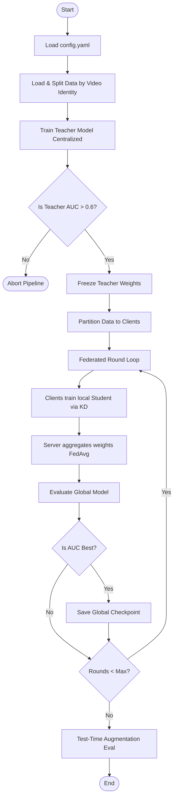
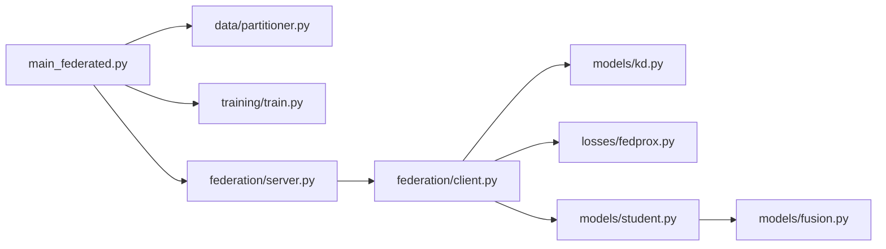
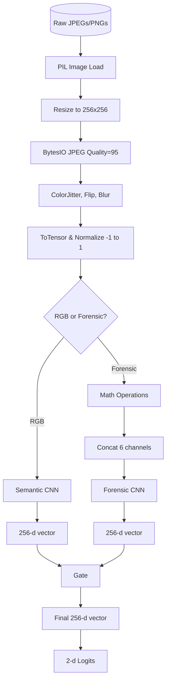
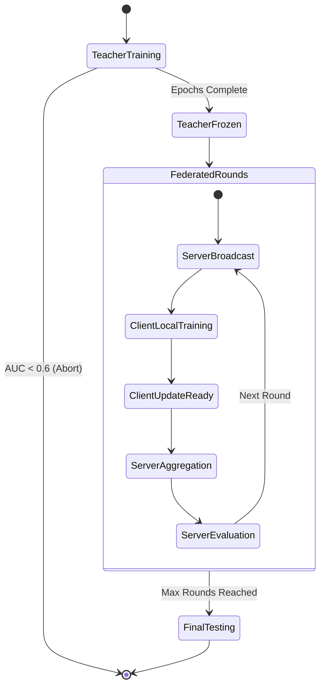
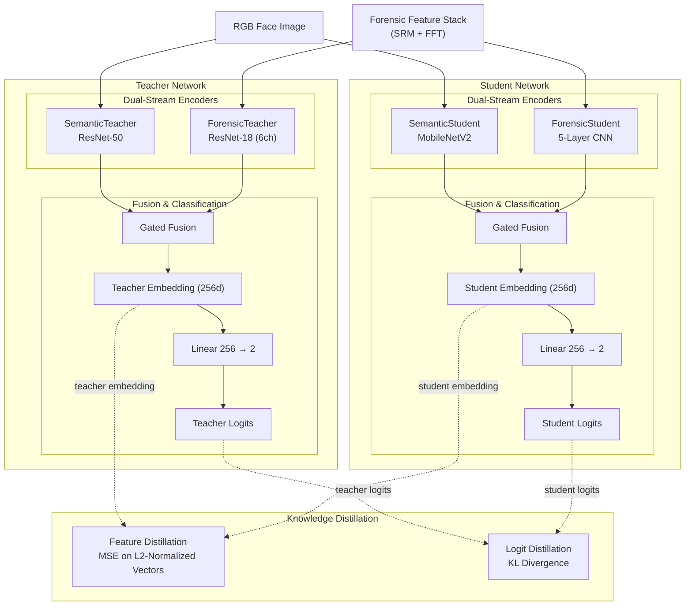
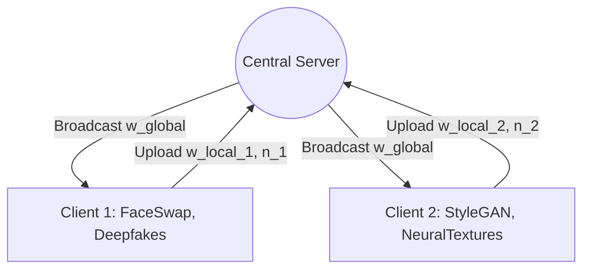

# Federated Deepfake Detection System: Architectural & Mathematical Walkthrough

> [!NOTE]
> This document is an exhaustive, deep-dive analysis of the Dual-Domain Federated Deepfake Detection codebase. It breaks down the architecture, data flows, every mathematical formula, and the federated learning mechanics.

---

## SECTION 1 — WHAT IS THIS THING?

**What does this application do in plain English?**
This application trains an AI model to detect "deepfakes" (AI-manipulated videos/images). Instead of just looking at the picture like a human would (semantic features), it also looks at invisible statistical and frequency anomalies left behind by AI generators (forensic features). Furthermore, it trains this model across multiple decentralized clients without ever sharing the raw video data, using a technique called Federated Learning.

**What problem is it solving?**
1. **Generalization:** Deepfake detectors often fail on new, unseen manipulation methods. By combining visual features with frequency/forensic features, the model learns universal artifacts rather than memorizing a specific generator.
2. **Data Privacy & Silos:** High-quality deepfake datasets (especially real-world or proprietary ones) cannot be legally or ethically centralized due to privacy constraints. Federated learning solves this by bringing the model to the data, rather than the data to the model.
3. **Edge Deployment:** Deepfake detection needs to run on phones or edge devices. The system uses Knowledge Distillation to compress a massive "Teacher" model into a tiny "Student" model that can be easily deployed.

**Inputs and Outputs**
- **Inputs:** Raw RGB images/video frames (real or manipulated).
- **Outputs:** A binary prediction (0 = Real, 1 = Fake), an embedding vector representing the facial/forensic signature, and the raw logits.

**Tech Stack**
- **PyTorch & Torchvision:** Core deep learning framework for defining neural networks, transforms, and automatic differentiation.
- **Scikit-Learn:** Used purely for rigorous threshold calibration and evaluation metrics (AUC, F1, Precision, Recall).
- **PyYAML:** For centralized configuration management (`config.yaml`).

---

## SECTION 2 — THE BIG PICTURE (ARCHITECTURE)



**Role of Each Component:**
- **Data Pipeline:** Loads, standardizes (forces JPEG compression pathways to normalize artifacts), and augments the data.
- **Forensic Extractor:** A deterministic, non-learned mathematical module that isolates high-frequency noise (SRM) and spectral anomalies (FFT).
- **Semantic Branch:** A CNN (ResNet for Teacher, MobileNet for Student) that looks at the RGB image to understand facial structure and visual artifacts (e.g., weird teeth, blurred boundaries).
- **Forensic Branch:** A CNN (ResNet for Teacher, Custom Lightweight CNN for Student) that looks at the 6-channel SRM/FFT stack to find statistical inconsistencies.
- **Gated Fusion:** Dynamically learns whether to trust the semantic vision or the forensic math more for any given image.

---

## SECTION 3 — HOW THE APP RUNS (FULL FLOW)

The complete lifecycle of `main_federated.py`:



**Control Flow (Flowchart):**


---

## SECTION 4 — EVERY MODULE, BROKEN DOWN

### `features/forensic.py`
- **Responsibility:** Extracts deterministic, non-learned high-frequency and spectral signals from RGB images.
- **Input:** RGB Tensor `(B, 3, H, W)`
- **Output:** Forensic Stack Tensor `(B, 6, H, W)`
- **Key Functions:** 
  - `compute_srm()`: Applies 3 Spatial Rich Model high-pass filters.
  - `compute_fft()`: Computes the magnitude spectrum of the Fourier transform.
- **If removed:** The entire forensic branch of the network would be starved of input, breaking the dual-domain architecture.

### `models/fusion.py`
- **Responsibility:** Intelligently combines semantic and forensic embeddings.
- **Input:** Two tensors `(B, D)`
- **Output:** One fused tensor `(B, D)`
- **Key Functions:** 
  - `forward()`: Concatenates, passes through a linear layer + sigmoid to create an attention gate, then computes a weighted sum.

### `models/teacher.py` & `models/student.py`
- **Responsibility:** Defines the neural architectures. Teacher uses heavy ResNets (ResNet-50 + ResNet-18). Student uses lightweight efficiency models (MobileNetV2 + Custom 5-Layer CNN).
- **Input:** `x_rgb`, `x_forensic`
- **Output:** Dictionary containing `logits` and `embedding`.

### `models/kd.py`
- **Responsibility:** Computes Knowledge Distillation losses to transfer "dark knowledge" from Teacher to Student.
- **Key Functions:**
  - `forward()`: Calculates MSE on L2-normalized embeddings, and KL-Divergence on temperature-softened logits.

### `losses/fedprox.py`
- **Responsibility:** Calculates the proximal regularization term to prevent client drift.
- **Key Functions:**
  - `forward()`: Computes the L2 norm between the current local weights and the frozen global weights.

### `federation/server.py` & `federation/client.py`
- **Responsibility:** Orchestrates the federated learning simulation.
- **Client:** Handles local training loops (`train_local`), AMP scaling, KD loss computation, and local evaluation.
- **Server:** Selects clients, broadcasts weights, aggregates updates (`fedavg_aggregate`), and evaluates the global model.



---

## SECTION 5 — DATA: WHERE IT COMES FROM, WHERE IT GOES



**Shape Transformations:**
1. `(H, W, 3)` Image
2. `(3, 256, 256)` Normalized Tensor
3. `(6, 256, 256)` Forensic Stack
4. `(1280, 8, 8)` MobileNet feature map
5. `(256)` Semantic Embedding
6. `(2)` Output Logits

---

## SECTION 6 — ALL STATES & TRANSITIONS



**Failure Modes Triggering Transitions:**
- If the Teacher fails to learn (AUC < 0.6), the system aborts because a broken Teacher will actively destroy the Student during KD.
- If Validation AUC fails to improve for `patience` checks during centralized student training (`main.py`), Early Stopping transitions the model to Final Testing.

---

## SECTION 7 — THE MATH & ALGORITHMS 

### 1. Spatial Rich Model (SRM) Filters
**What it is:** High-pass filters that destroy image content (semantics) and expose local noise residuals (manipulation artifacts).

**The Math (Convolution):**
```math
Y = X * K
```
Where $K$ contains fixed $3 \times 3$ matrices. Example of a filter kernel:
```math
K_1 = \begin{bmatrix} 0 & 1 & 0 \\ 0 & -1 & 0 \\ 0 & 0 & 0 \end{bmatrix}
```
**Intuition:** It calculates the difference between a pixel and its neighbors. If a face is smoothly generated but blended poorly, the differences at the blending boundary will spike.

### 2. Forensic Standardization
**What it is:** Normalizing the SRM and FFT channels so one doesn't mathematically dominate the other in the CNN.

**The Math:**
```math
\hat{X}_{ch} = \frac{X_{ch} - \mu_{ch}}{\sigma_{ch} + \epsilon}
```
**Intuition:** FFT values can range from 0 to 8 (log scale), while SRM values are near 0. Without standardization, the CNN weights would become heavily skewed toward the FFT channels.

### 3. Gated Fusion
**What it is:** A learned attention mechanism to combine two vectors.

**The Math:**
```math
\alpha = \sigma(W_{gate} \cdot [E_{sem} \oplus E_{for}] + b)
```
```math
E_{fused} = \alpha E_{sem} + (1 - \alpha) E_{for}
```
**Variables:** $E_{sem}$ is semantic embedding, $E_{for}$ is forensic embedding. $\alpha \in (0, 1)$.
**Intuition:** If the image is heavily compressed, the forensic features might be destroyed (noise). The network learns to look at both, realize the forensic vector is useless, push $\alpha$ toward 1, and rely purely on the semantic vector.

### 4. Knowledge Distillation (KD)
**What it is:** Forcing the Student to mimic the Teacher. The diagram below illustrates exactly how the dual-stream encoders process data and where the distillation losses attach to the network flow.



**Feature KD (MSE on L2-Normalized Vectors):**
```math
\mathcal{L}_{feat} = \left\| \frac{Z_s}{\|Z_s\|_2} - \frac{Z_t}{\|Z_t\|_2} \right\|_2^2
```
*Intuition:* By L2-normalizing the vectors first, we measure the *angular distance* (cosine similarity equivalent) between the embeddings, ignoring magnitude differences between the massive teacher and tiny student.

**Logit KD (KL-Divergence):**
```math
\mathcal{L}_{KL} = T^2 \sum p_t \log\left(\frac{p_t}{p_s}\right)
```
Where $p = \text{softmax}(z/T)$.
*Variables:* $T$ is temperature. Higher $T$ softens the probabilities. The $T^2$ multiplier scales the gradients back up.

### 5. FedProx Regularization
**What it is:** Prevents client drift in non-IID federated learning.

**The Math:**
```math
\mathcal{L}_{FedProx} = \frac{\mu}{2} \sum_{i} \left\| w_{local}^{(i)} - w_{global}^{(i)} \right\|_2^2
```
**Variables:** $\mu$ controls the strength. $w_{local}$ are the weights currently being trained. $w_{global}$ are the frozen weights received from the server at the start of the round.
**Intuition:** It acts as an elastic band. The local model wants to minimize Cross-Entropy on its local data, but if it steps too far away from the global consensus, this penalty snaps it back.

### 6. The Master Objective Function (Student Total Loss)
**What it is:** The single equation that combines all the local task and regularization goals into one number for the Student to minimize.

**The Math:**
```math
\mathcal{L}_{Total} = \mathcal{L}_{CE} + \lambda_{feat} \mathcal{L}_{feat} + \lambda_{KL} \mathcal{L}_{KL} + \mathcal{L}_{FedProx}
```
**Variables:**
- `L_CE`: Cross-Entropy loss (how well the student predicts Real vs Fake).
- `lambda_feat` and `lambda_KL`: Hyperparameters (from `config.yaml`) controlling how much the Student should care about mimicking the Teacher's features vs logits.
- `L_FedProx`: The proximal penalty controlled by `mu`.
**Intuition:** The Student is fighting a three-way tug-of-war. It wants to learn from the raw data (`L_CE`), it wants to copy the Teacher's homework (`λ * L_KD`), and the Server is holding it back by a leash so it doesn't drift too far from the group (`L_FedProx`).

### 7. Threshold Calibration
**What it is:** Finding the optimal probability threshold to separate Real from Fake.

**The Math:**
```math
F_1(t) = 2 \frac{P(t) \cdot R(t)}{P(t) + R(t)}
```
```math
t_{opt} = \arg\max_t F_1(t)
```
**Intuition:** Defaulting to 0.5 is naive if the dataset is imbalanced. This plots every possible threshold and picks the one that maximizes the harmonic mean of Precision and Recall.

---

## SECTION 8 — FEDERATED / DISTRIBUTED VERSION

**How it differs from centralized:**
In `main.py`, the Student sees all data in a shuffled, IID (Independent and Identically Distributed) manner. In `main_federated.py`, data is partitioned. Client 1 might only see FaceSwap and Deepfakes, while Client 2 only sees StyleGAN and NeuralTextures.

**Topology:** Star Topology.


### Federated Learning Algorithm (Textbook Pseudo-Code)

Below is the formal step-by-step algorithm detailing exactly how the Federated Knowledge Distillation loop operates.

```text
Algorithm 1: Dual-Domain Federated Knowledge Distillation (FedProx)
───────────────────────────────────────────────────────────────────
Input: Set of clients K, Server, Frozen Teacher model T
Hyperparameters: Number of rounds R, Local epochs E, Learning rate η, FedProx weight μ, Feature KD weight λ

1: Server initializes Global Student model S_0
2: for round r = 1, 2, ..., R do
3:     Server selects a subset of clients S_r ⊆ K
4:     Server broadcasts global weights w_r to all clients k ∈ S_r
5:     
6:     // Local Training Phase
7:     for each client k ∈ S_r in parallel do
8:         w_{r,k} ← ClientUpdate(k, w_r, T)
9:     
10:    // Server Aggregation Phase (FedAvg logic)
11:    N ← Total samples across all active clients
12:    w_{r+1} ← ∑_{k ∈ S_r} (n_k / N) * w_{r,k}
13:    
14:    Evaluate w_{r+1} on Validation Set

───────────────────────────────────────────────────────────────────
function ClientUpdate(k, w_global, T)
1: Initialize local student model S_k with weights w_global
2: for local epoch e = 1 to E do
3:     for each batch (X_rgb, y_true) in local dataset D_k do
4:         
5:         // 1. Data Preparation
6:         X_for ← compute_SRM_and_FFT(X_rgb)
7:         
8:         // 2. Teacher Forward Pass (Frozen, No Gradients)
9:         Z_teacher, _ ← T(X_rgb, X_for)
10:        
11:        // 3. Student Forward Pass
12:        Z_student, Y_logits ← S_k(X_rgb, X_for)
13:        
14:        // 4. Compute Losses
15:        L_CE ← CrossEntropy(Y_logits, y_true)
16:        L_KD ← || (Z_student / ||Z_student||₂) - (Z_teacher / ||Z_teacher||₂) ||²
17:        L_Prox ← (μ / 2) * || S_k.weights - w_global ||²
18:        L_Total ← L_CE + λ * L_KD + L_Prox
19:        
20:        // 5. Backpropagation
21:        S_k.weights ← S_k.weights - η * ∇L_Total
22:        
23: return S_k.weights
```


**Math of Federation (FedAvg):**
```math
w_{global} = \sum_{k=1}^{K} \frac{n_k}{N} w_k
```
**Variables:** $n_k$ is the number of samples Client $k$ trained on. $N$ is the total samples across all participating clients. $w_k$ is the weight tensor from Client $k$.
**Intuition:** Clients with more data get a proportionally louder vote in the global consensus.

**Privacy Mechanisms:**
Currently, this is vanilla FedAvg/FedProx. It provides *data-minimization privacy* (raw JPEGs never leave the client's hard drive). However, it does *not* utilize Differential Privacy (DP-SGD) or Secure Multi-Party Computation (SMPC). Thus, it is theoretically vulnerable to gradient-inversion attacks where an evil server reconstructs images from local client weights.

---

## SECTION 9 — EDGE CASES & FAILURE MODES

**1. The "Double-Correction" Collapse**
*Failure:* If `class_weights` designed to heavily penalize "Real" samples are passed to the Student while simultaneously using a `WeightedRandomSampler`, the Student's Cross-Entropy gradients for the "Fake" class vanish.
*Symptom:* The Student outputs raw probabilities near 0.01 for everything.
*Fix:* Disabled logit KD entirely for binary classification, forcing reliance on Feature KD and unweighted local CE loss.

**2. DataLoader Deadlocks on Windows**
*Failure:* `num_workers > 0` combined with `pin_memory=True` causes Python's multiprocessing `spawn` context to hang on Windows IPC queues.
*Symptom:* The terminal completely freezes midway through an epoch, often stuck on a CUDA synchronization point (`v.item()`).
*Fix:* Hardcoded `num_workers=0` for all Windows deployments.

**3. Test-Time Domain Shift (Compression)**
*Limitation:* The model trains on FF++ (relatively clean). When tested on DFDC (heavy H.264 compression), high-frequency forensic features are destroyed.
*Symptom:* High Val AUC (0.95), mediocre Test AUC (0.76).
*Scaling Fix:* To deploy this at a 10x scale, the training pipeline *must* ingest aggressively compressed H.264 video frames, not just mildly JPEG-compressed images.

---

## SECTION 10 — GLOSSARY

- **AUC (Area Under the Receiver Operating Characteristic Curve):** A metric from 0 to 1 that measures how well the model ranks Real vs Fake, independent of any specific threshold. 0.5 is random guessing.
- **Logits:** The raw, un-normalized mathematical output of the neural network's final linear layer, before the Softmax function turns them into probabilities (0 to 1).
- **Knowledge Distillation (KD):** Training a small, fast model (Student) by forcing it to mathematically copy the internal states and outputs of a massive, slow model (Teacher).
- **SRM (Spatial Rich Model):** A set of fixed high-pass filters borrowed from steganalysis (detecting hidden messages in images) used to expose noise residuals.
- **FFT (Fast Fourier Transform):** An algorithm that converts an image from pixels (spatial domain) into frequencies (spectral domain).
- **FedAvg (Federated Averaging):** The standard algorithm for combining decentralized models by taking a weighted mathematical average of their tensors.
- **FedProx:** An upgrade to FedAvg that adds a "leash" (proximal penalty) to local models, preventing them from overfitting to their local biased data before averaging.
- **TTA (Test-Time Augmentation):** Evaluating the same image 5 different ways (original, flipped, blurred, bright, dark) and averaging the predictions to get a more robust final answer.
